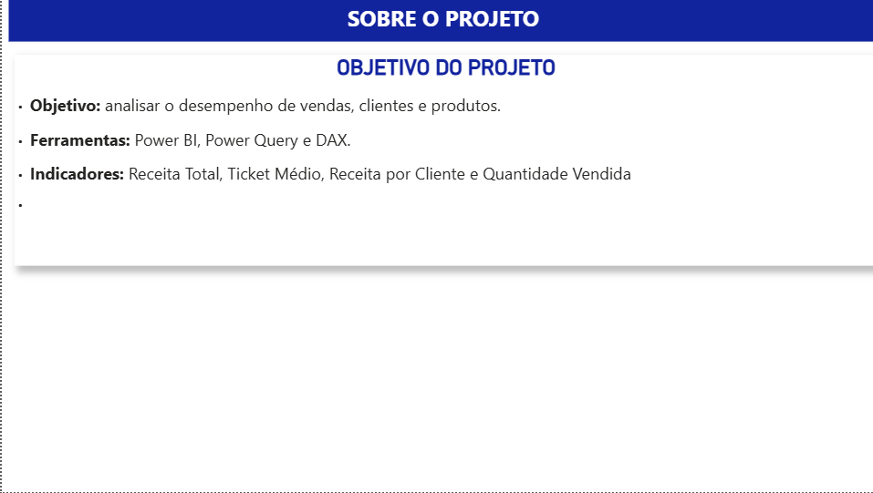
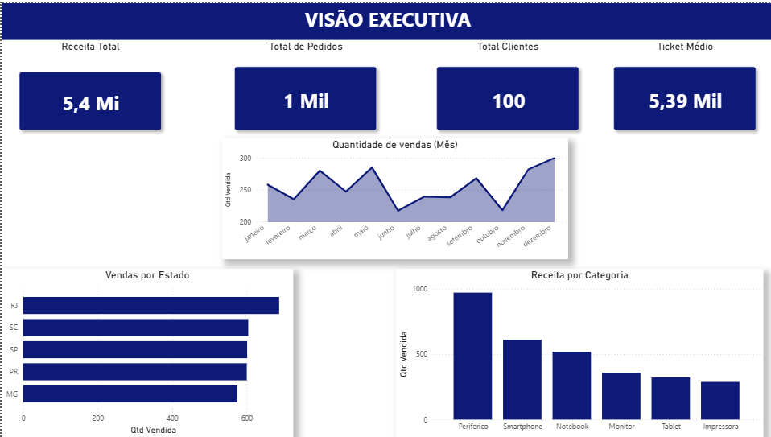
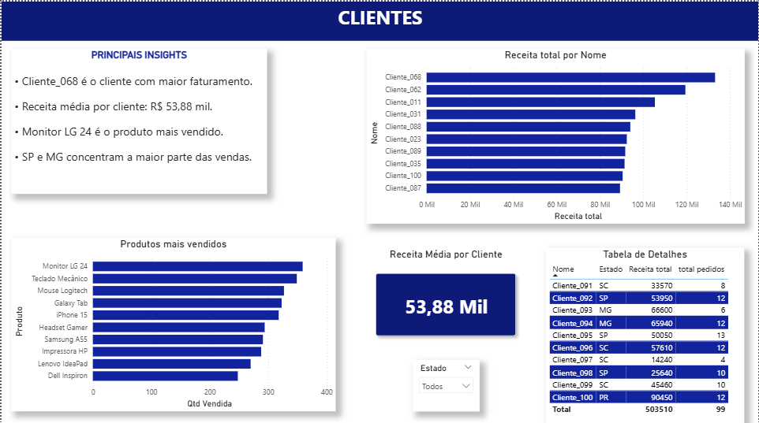
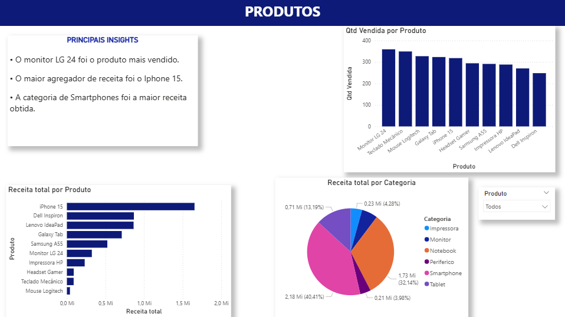
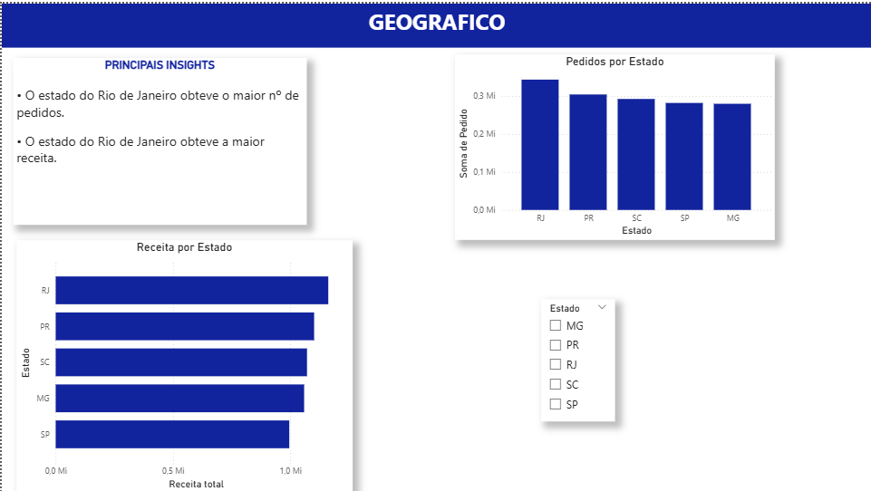

# Dashboard de Vendas - Power BI

## Objetivo

Analisar o desempenho de vendas, clientes e produtos.

## Ferramentas

- Power BI
- Power Query
- DAX

## Indicadores

- Receita Total
- Ticket Médio
- Receita Média por Cliente
- Quantidade Vendida

## Sobre o Projeto

## Visão Executiva

## Clientes

## Produtos

## Geográfico

